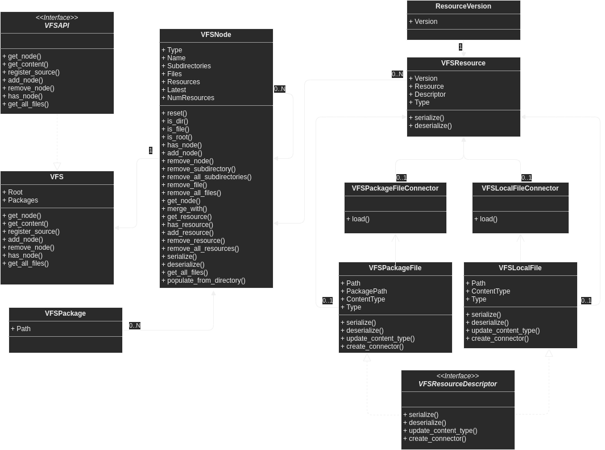

Virtual File System
============================================

ResourceVersion
-----------------------------------------
.. autoclass:: murasame.pal.vfs.resourceversion.ResourceVersion
   :members:

VFS
-----------------------------------------
.. autoclass:: murasame.pal.vfs.vfs.VFS
   :members:

VFSLocalFile
-----------------------------------------
.. autoclass:: murasame.pal.vfs.vfslocalfile.VFSLocalFile
   :members:

VFSLocalFileConnector
-----------------------------------------
.. autoclass:: murasame.pal.vfs.vfslocalfileconnector.VFSLocalFileConnector
   :members:

VFSNode
-----------------------------------------
.. autoclass:: murasame.pal.vfs.vfsnode.VFSNode
   :members:

VFSPackage
-----------------------------------------
.. autoclass:: murasame.pal.vfs.vfspackage.VFSPackage
   :members:

VFSPackageFile
-----------------------------------------
.. autoclass:: murasame.pal.vfs.vfspackagefile.VFSPackageFile
   :members:

VFSPackageFileConnector
-----------------------------------------
.. autoclass:: murasame.pal.vfs.vfspackagefileconnector.VFSPackageFileConnector
   :members:

VFSResource
-----------------------------------------
.. autoclass:: murasame.pal.vfs.vfsresource.VFSResource
   :members:

VFSResourceConnector
-----------------------------------------
.. autoclass:: murasame.pal.vfs.vfsresourceconnector.VFSResourceConnector
   :members:

VFSResourceDescriptor
-----------------------------------------
.. autoclass:: murasame.pal.vfs.vfsresourcedescriptor.VFSResourceDescriptor
   :members:

VFSResourceTypes
-----------------------------------------
.. autoclass:: murasame.pal.vfs.vfsresourcetypes.VFSResourceTypes
   :members:
